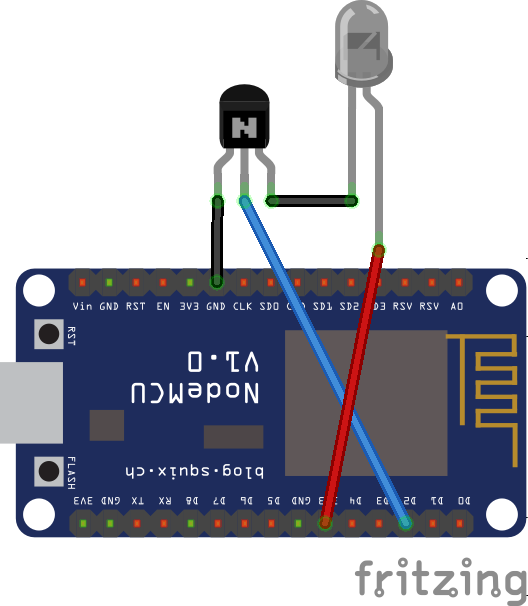
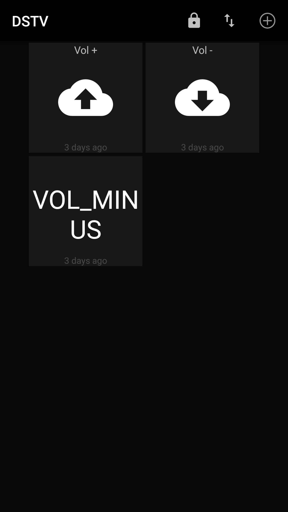

# esp8266 based DSTV A6 IRremote
[](https://travis-ci.com/mmphego/DSTV-WiFi-Remote)

Control your DSTV and TV(Samsung) via WiFi or Amazon Alexa with an esp8266.

# Circuit


<!---
# Control
I resorted to using [MQTT Dash](https://play.google.com/store/apps/details?id=net.routix.mqttdash&hl=en) for control purposes.




# Future Development
Integrate to my [Node-Red Dashboard](https://nodered.org/) running on a network media server.
-->

## Usage

- **Help**

```bash
make help
```

- **Install libraries**
If planning on using Travis CI, you will need to install [travis-client.rb](https://github.com/travis-ci/travis.rb) via [docker](https://github.com/mmphego/my-dockerfiles/tree/master/travis-client) or gems.

```bash
# Optional
sudo apt-get install ruby ruby-dev
sudo gem install -n /usr/local/bin travis
travis login --com # Login with your GitHub credentials
# [secure]
travis env set tokens "#ifndef tokens_h \n #define tokens_h \n \n #define MyApiKey    \"YOUR TOKEN\" \n #define SwitchId    \"YOUR ID\" \n #define LightId     \"YOUR ID\" \n \n #endif" --com
```

[Not Secure]
or create a src/tokens.h and copy in your credentials.
```
#ifndef tokens_h
  #define tokens_h

#define MyApiKey
#define SwitchId
#define LightId

#endif
```

Now we need to install platformio and all its dependencies.
```bash
make install
```

- **Compiling Clang code**
```bash
make build
```

- **Upload bin to device**
```bash
make upload
```

## Feedback

Feel free to fork it or send me PR to improve it.
